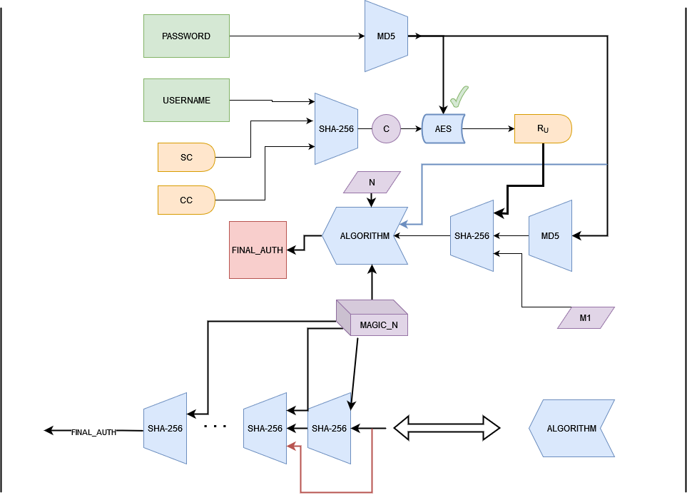
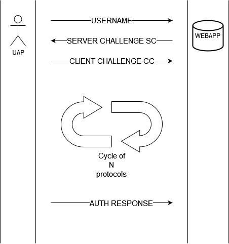

# Project-2-SIO-equipa_16

### Authors
        - Nuno Cunha, 98124
        - Filipe Silveira, 97981
        - Nuno Matos, 97915
        - Ana Rosa, 98678
        
### Dependencies (tested on Python 3.8.10)
        pip install Flask
        pip install cryptography

### Project Description

UAP features:

- Allows multiple users, each with their own key pairs (DNS-username-password).
- Allows new users to register.
- A user can add, remove, and edit their key pairs.
- Allows asynchronous authentication in a web app, with a socket to listen for connections on port 6000. In this sense, you only need to have the UAP connected with the session started, so no interaction is required from the user other than clicking the “UAP” button in the web app.
- It has several shortcuts, such as clicking “enter” to submit data/edit key pairs, ‘delete’ to delete key pairs, and “double left click” to view the password.
- The UAP was compiled to exe, because otherwise it would be trivial for an attacker to gain access to user accounts.
- UAP logs the user out every ten minutes.

Encryption in the UAP:

- The data.json file is encrypted with symmetric encryption using AES CBC mode, where the KEY and IV are stored in the UAP code. It should be noted that since the UAP is compiled in exe, it is more difficult for an attacker to discover the KEY and IV.
- The passwords and usernames of UAP users are also encrypted, with the username being hashed (sha-256) and the password being hashed (sha-256) with a salt (suffix). The salt is obtained through a hash (sha-256) on the user ID. 
- A user's key pair passwords are encrypted with AES CBC mode, which is a symmetric cipher, where the KEY and IV are different for each app user. The last 4 characters of the KEY are the first 4 of the current user, and the first 4 characters of the IV are the first 4 of the current user.
- All key pair passwords have a different salt that is obtained through a hash (sha-256) on the key pair ID, which is then added to the password (suffix). Finally, the password is encrypted with AES CBC mode where the KEY and IV are unique to that user.

Webapp:

- When clicking on the UAP button, the webapp sends a request to the user that will be picked up by the UAP.
- While the e-chap is being performed, the webapp waits, displaying a loading page, and when it is complete, the user is redirected to their account.

